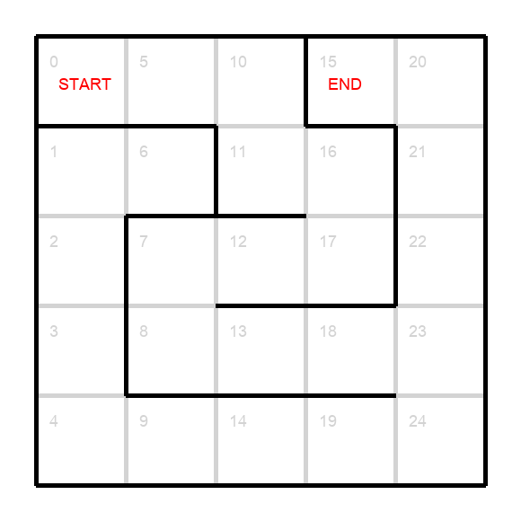
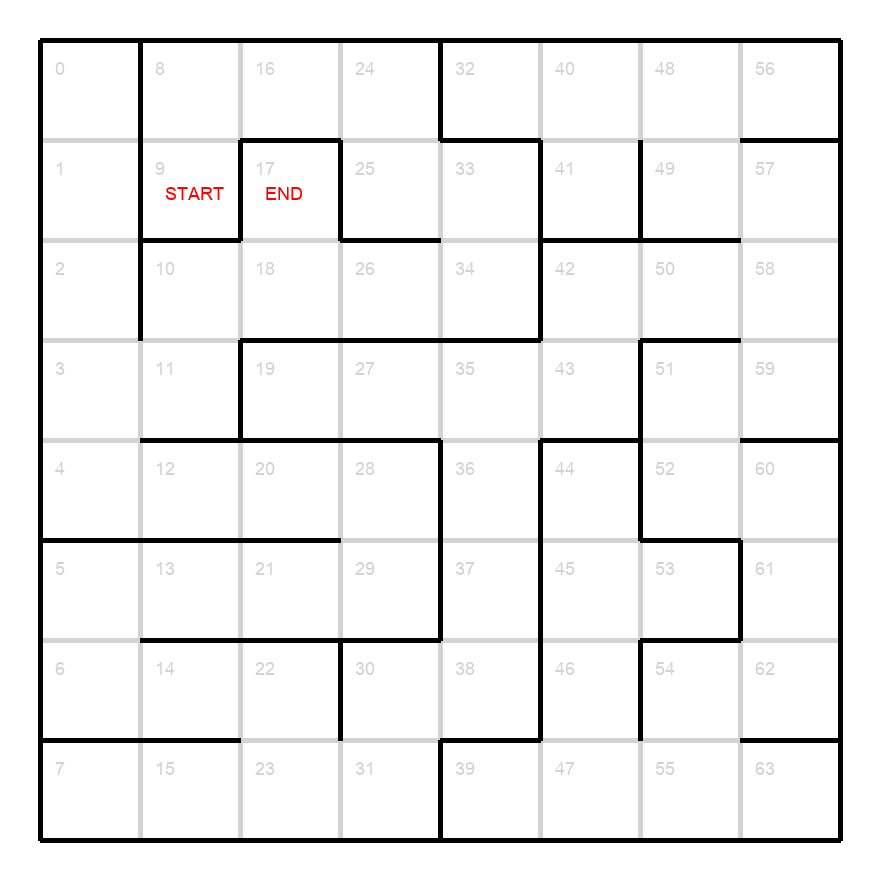
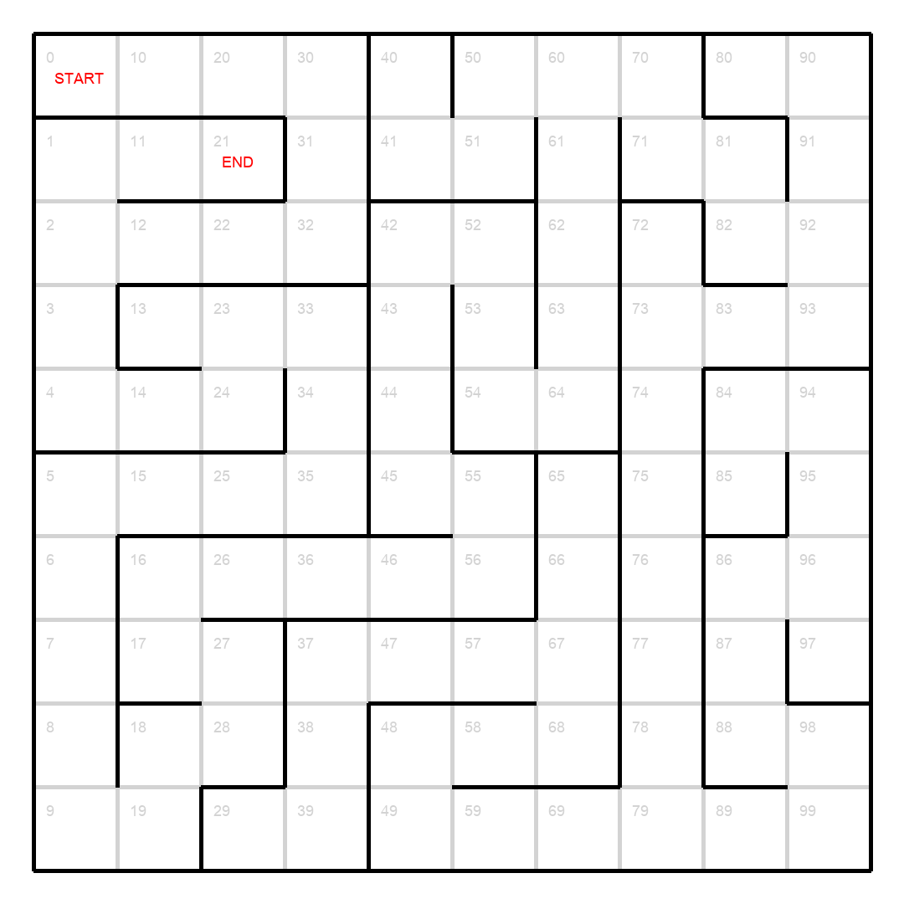
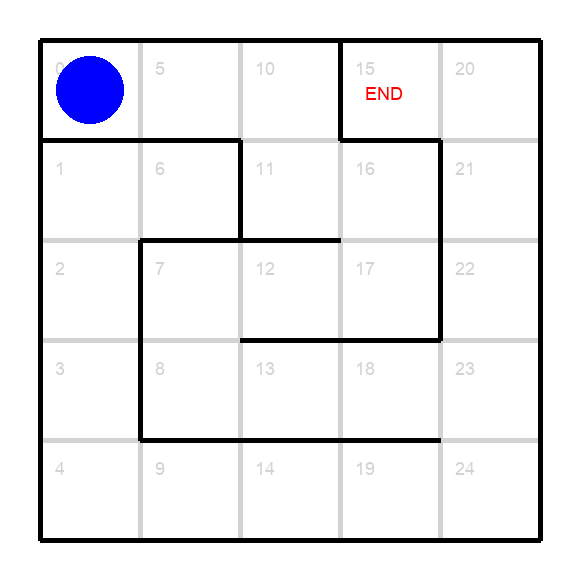
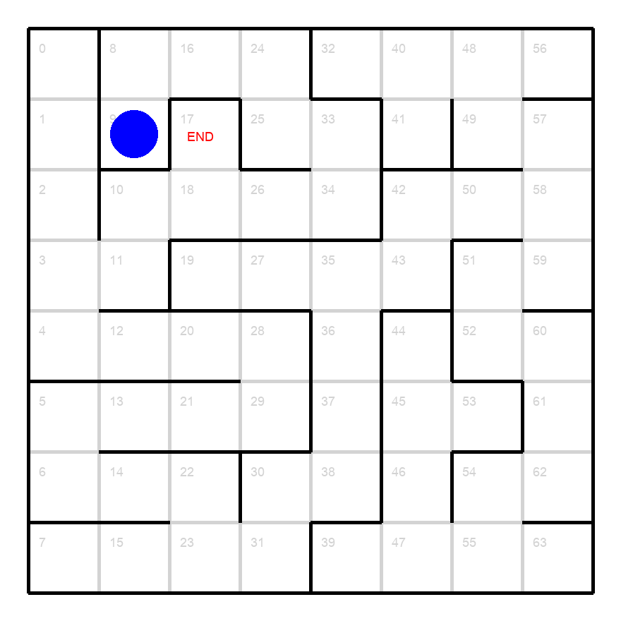
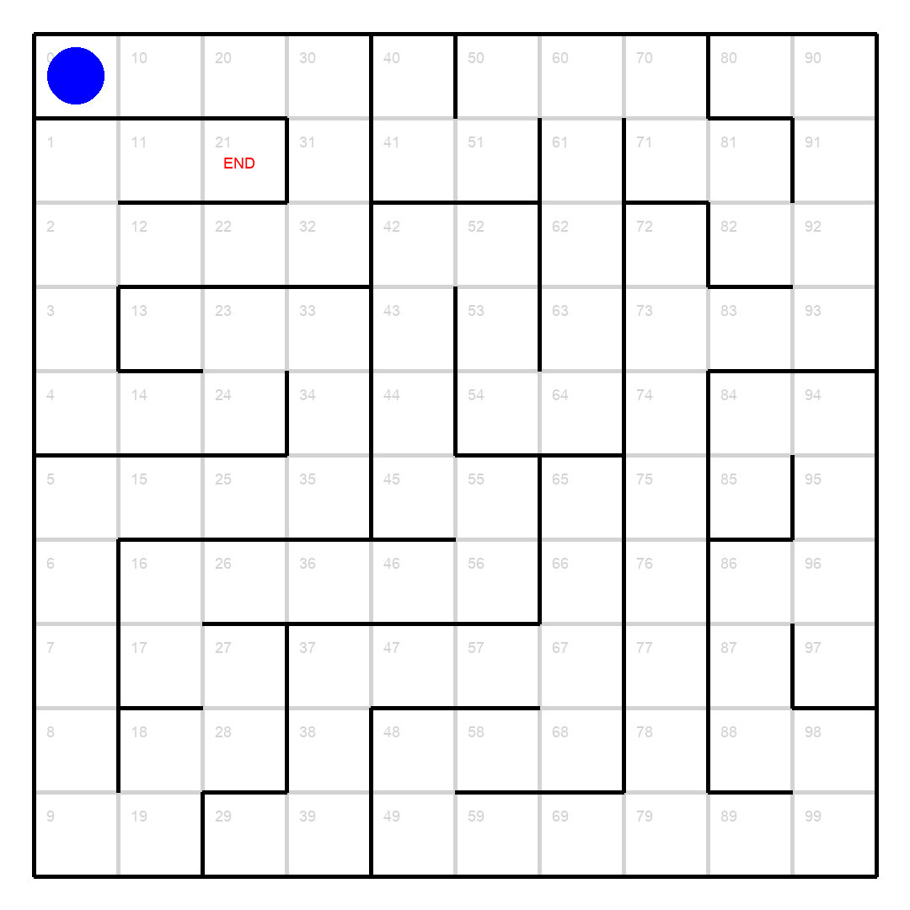

# Examples

This directory contains sample maze images and solution animations demonstrating the capabilities of the RL Maze Solver.

## Static Maze Images

### 5x5 Maze


A small maze perfect for quick testing and demonstration. Shows the basic maze structure with start (red "START") and end (red "END") positions clearly marked.

### 8x8 Maze


A medium-sized maze that provides more complexity while still being easily visualizable. Demonstrates the recursive backtracking algorithm's ability to create interesting path structures.

### 10x10 Maze


A larger maze showcasing the scalability of both the maze generation and RL solving algorithms. The increased complexity requires more training epochs for optimal pathfinding.

## Animated Solutions

### 5x5 Solution


Shows the Q-learning agent navigating through the small maze. The blue circle represents the agent moving from start to goal following the learned optimal policy.

### 8x8 Solution


Demonstrates the agent's ability to find efficient paths in medium-complexity mazes. Notice how the agent avoids dead ends and finds a direct route to the goal.

### 10x10 Solution


Illustrates the agent's performance on larger mazes. The longer path demonstrates the algorithm's ability to handle increased state space complexity.

## Generation Details

These examples were generated using the following parameters:

- **Learning Rate (α)**: 0.9
- **Discount Factor (γ)**: 0.8
- **Training Epochs**: 
  - 5x5: 500 epochs
  - 8x8: 1000 epochs
  - 10x10: 2000 epochs

## Regenerating Examples

To generate new examples, run:

```bash
python3 generate_examples.py
```

This will create new random mazes and train fresh agents to solve them, potentially producing different maze layouts and solution paths.
